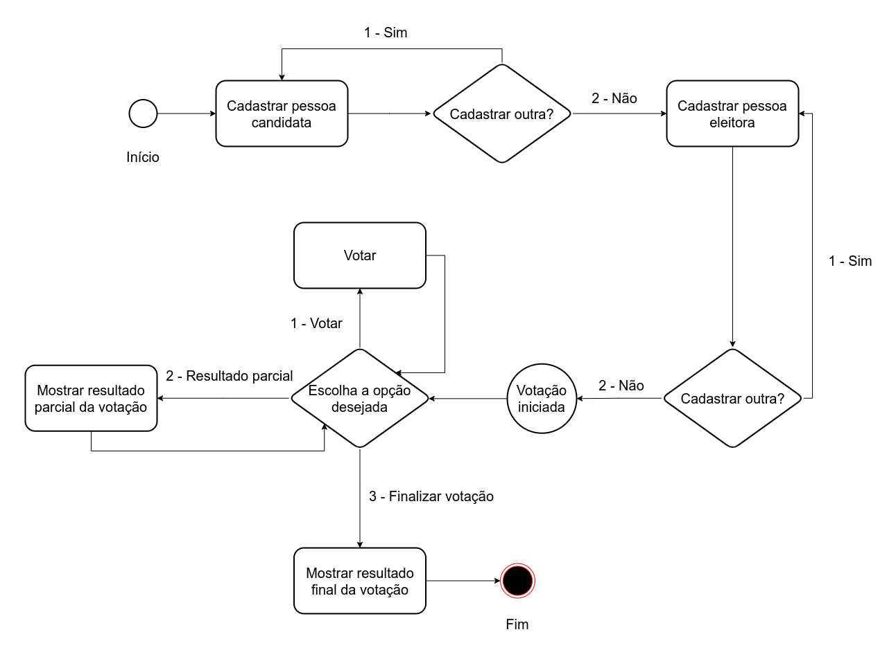

# Challenge Requirements: Voting System

Due to your knowledge in Java, you have been tasked with developing an electronic voting system. The idea is for this system to allow for the registration of candidate individuals, voter individuals, the voting process, and the partial and final results of the voting.

The system flow is defined by three main stages that must be executed in the following order:

1. **Register candidate individuals:** In this stage, there must be a menu for the registration of candidate individuals, and at the end of each new person's registration, there should be an option to register another. When there are no more candidate individuals to be registered, the registration stage for voter individuals begins.

2. **Register voter individuals:** Here, there must be a menu that allows for the registration of voter individuals, similar to the menu for registering candidate individuals. After completing the registration, the menu should return to the initial state of the voter registration menu to offer the opportunity to register a new individual. When there are no more voter individuals to be registered, the system should move on to the voting stage.

3. **Start voting process:** In this stage, the voting process begins, where a menu is requested in the task that offers the options to `vote`, `view partial results`, and `finish voting`. The following are the details for each option:

- When the `vote` option is chosen, the identifier of the voter individual (e.g. CPF) and the number of the candidate individual they wish to vote for is requested. After voting, the menu should return to the initial state, offering the options to vote, `view partial results`, and `finish voting`.
- The `view partial results` option should list all the candidate individuals' names, showing the absolute number of votes received by each candidate individual and their percentage of votes. After viewing the partial results, the menu should return to the initial state, offering the options to `vote`, `view partial results`, and `finish voting`.
- The `finish voting` option should show the voting result by listing the candidate individuals, the absolute number of votes per candidate individual, and the percentage of total votes each candidate individual received. With the voting process closed, the program should be finalized.

The following image represents the system flow graphically.



This system should have five classes: `Main`, `VotingManagement`, `Person`, `CandidatePerson`, and `VoterPerson`. Each of them is described below:

- `Main`: This class should contain the `main` method, which in turn should contain (I) an instance of the `VotingManagement` class, (II) an instance of the Scanner class to read user input from the console, and (III) three loops that represent the application's menus. The first loop should contain the menu for registering candidate people, the second should contain the menu for registering voter people, and the third should contain the menu for voting, viewing partial results, and finalizing the vote.

  - The menu for the first loop should have the following format:

```
    Register candidate person?
    1 - Yes
    2 - No
    Enter the corresponding number for the desired option:
```


If the user enters the value 1 (which indicates that they want to register a candidate person), the message `Enter the name of the candidate person:` should be printed on the console. Then, after entering the name of the candidate person and pressing enter, the message `Enter the number of the candidate person:` will appear on the console. After the user enters the number of the candidate person, the system should return to the initial state of the menu. Assuming the name of the first candidate person is "Maria" and her voting number is "1", an example of the console content after registering the first candidate person will be:

```
    Register candidate?
    1 - Yes
    2 - No
    Enter the corresponding number for the desired option:
    1
    Enter the name of the candidate:
    Maria
    Enter the candidate's number for voting:
    1
    Register candidate?
    1 - Yes
    2 - No
    Enter the corresponding number for the desired option:
```

This cycle repeats until there are no more candidates to be registered. When this happens, the user will enter option 2 from the menu, which will stop the first loop. The second loop, which represents the step of registering voters, should be started immediately afterward.

⚠️🔴**IMPORTANT: to facilitate the use of the Java Scanner class, only the candidate's first name is registered - i.e. Maria, not Maria Silva or Maria Clara.** 🔴⚠️

⚠️🔴**TIP: use a variable of type short to store the option entered by the user, since it is a small-scale numerical value.** 🔴⚠️

- The menu of the second loop should have the format:
```
    Register voter?
    1 - Yes
    2 - No
    Enter the number corresponding to the desired option:
```


If the user enters the value 1 (indicating they want to register an eligible voter), the message `Enter the name of the eligible voter:` will be printed to the console. Then, after entering the name of the eligible voter and pressing enter, the message `Enter the CPF of the eligible voter:` will appear in the console. Once the user enters the CPF of the eligible voter, the system should return to the initial state of the menu. Assuming the name of the first eligible voter is Joao, with CPF 978.413.510-89, an example of the console content after registering it will be:

```
        Register voter?
        1 - Yes
        2 - No
        Enter the corresponding number of the desired option:
        1
        Enter the name of the voter:
        João
        Enter the CPF of the voter:
        978.413.510-89
        Register voter?
        1 - Yes
        2 - No
        Enter the corresponding number of the desired option:
```

This cycle repeats until there are no more voters to be registered. At the end of this registration, the user will enter option 2 from the menu, which will stop the second loop and start the third, marking the beginning of the voting process.

⚠️🔴**IMPORTANT: To facilitate the use of the Java Scanner class, only the first name of the voter is registered - i.e. João, not João Silva or João Carlos.** 🔴⚠️

- The menu for the third loop should have the following format:

```    
    Enter the number corresponding to the desired option:
    1 - Vote
    2 - Partial Result
    3 - Finish Voting
```
If the user enters the value 1 (indicating that they want to cast a vote), the message `Enter the voter's CPF:` will be printed on the console. Then, after entering the voter's CPF and pressing enter, the message `Enter the candidate's number:` will appear on the console. Once this is done, the vote must be computed and the system returns to the initial state of the menu. Assuming that the CPF of the first voter is 978.413.510-89, and the number of the candidate is 1, an example of the console content after casting a vote will be:

```
    Enter the number corresponding to the desired option:
    1 - Vote
    2 - Partial Result
    3 - Finish Voting
    1
    Enter the voter's CPF:
    978.413.510-89
    Enter the candidate's number:
    1
    Enter the number corresponding to the desired option:
    1 - Vote
    2 - Partial Result
    3 - Finish Voting
```

⚠️🔴**IMPORTANT: each voter can only vote once.** 🔴⚠️

On the other hand, if the user enters the value 2 (indicating that they want to view the partial result), the partial result should be printed to the console. Assuming we have only one candidate, Maria, and one voter, João, and that João voted for Maria, an example of the console content after choosing option 2 (Partial Result) will be:
        
```
    Enter the corresponding number for the desired option:
    1 - Vote
    2 - Partial Result
    3 - Finish Voting
    2
    Name: Maria - 1 votes (100.0%)
    Total votes: 1
    Enter the corresponding number for the desired option:
    1 - Vote
    2 - Partial Result
    3 - Finish Voting
```

This cycle repeats until the user chooses option 3 (End Voting). When option 3 is selected, the third loop should be terminated, printing the voting results, similar to the partial result, followed by the program's termination.

Assuming we have only one candidate, Maria, and one voter, João, and João voted for Maria, an example of the console output after selecting option 3 (End Voting) will be:

```
   Entre com o número correspondente à opção desejada:
   1 - Vote
   2 - Partial Result
   3 - Finish Voting
   3

   Voting result:
   Name: Maria - 1 votes ( 100.0% )
   Total votes: 1
```

The following figure shows the repetition loops:


- `VotingManagement`: this class is responsible for managing the voting and registration of candidates and voters. The `Main` class should instantiate an object of the `VotingManagement` class to handle the entire voting and registration process. It will have four private attributes:

- `candidatePeople`: this attribute is a dynamic array of objects of the `CandidatePerson` class and, to facilitate its manipulation, it should be an instance of the `ArrayList` class. For more information, you can check the [W3Schools](https://www.w3schools.com/java/java_arraylist.asp) website or [JavaPoint](https://www.javatpoint.com/java-arraylist), or consult the Oracle documentation. This array is responsible for keeping a list of registered candidate people, that is, the instantiated objects of the `CandidatePerson` class.

- `voterPeople`: this attribute is a dynamic array of objects of the `VoterPerson` class and, to facilitate its manipulation, it should be an instance of the `ArrayList` class. For more information, you can check the [W3Schools](https://www.w3schools.com/java/java_arraylist.asp) website or JavaPoint, or consult the Oracle documentation. This array is responsible for keeping a list of registered voter people, that is, the instantiated objects of the `VoterPerson` class.

- `computedCpf`: this attribute is a dynamic array of Strings and, to facilitate its manipulation, it should be an instance of the `ArrayList` class. For more information, you can check the [W3Schools](https://www.w3schools.com/java/java_arraylist.asp) website or [JavaPoint](https://www.javatpoint.com/java-arraylist), or consult the Oracle documentation. This array is responsible for keeping the CPFs of the voters who have already voted in a list of Strings, so that we can check if the voter has already voted. Remember that each voter can only vote once.

- `totalVotes`: this integer attribute is responsible for counting the number of votes that have been cast, so that it can be used in the end to compute the percentage of votes received by each candidate and also to show the total number of votes already computed.

This class should also contain at least five methods, where four are public and one is private. They are:

- `registerCandidatePerson`: This public method should receive two parameters: the `name` and the `number` of the candidate person. The `name` parameter is of type String and the `number` parameter is of type integer. This method should check if the number of the candidate person is already registered and, if it is, it should print the message `Candidate person number already used!` on the console. Otherwise, it should instantiate an object of the class `CandidatePerson` passing the parameters `name` and `number` to the constructor of the class `CandidatePerson`. Finally, add this new instantiated object to the `candidatePeople` array (Hint: use the .add method of the `ArrayList` class). This method should have a return type of `void`.

- `registerVoterPerson`: This public method should receive two String type parameters: the `name` and `cpf` of the voter person. This method should check if the CPF of the voter person is already registered and, if it is, it should print the message `Voter person already registered!` on the console. Otherwise, it should instantiate an object of the class `VoterPerson` passing the parameters `name` and `cpf` to the constructor of the class `VoterPerson`. Finally, add this new instantiated object to the `voterPeople` array (Hint: use the .add method of the `ArrayList` class). This method should have a return type of `void`.

- `vote`: This public method should receive two parameters: the `voterPersonCPF` and the `candidatePersonNumber`. The `voterPersonCPF` parameter is of type String, and the `candidatePersonNumber` parameter is of type integer. This method should check if the CPF of the voter person is already inserted in the `computedCPF` array and, if it is, it should print the message `Voter person already voted!` on the console. Otherwise, it should loop through the `candidatePeople` array to find the object of the candidate person that has the number passed by the `candidatePersonNumber` parameter. When it finds the object that represents the candidate person, it should call the receiveVote method of the object of the `CandidatePerson` class. Finally, it should insert the CPF of the voter person in the `computedCPF` array so that this voter person cannot vote again (Hint: use the .add method of the `ArrayList` class). This method should have a return type of `void`.

- `showResult`: This public method is responsible for printing the election result, whether partial or final, to the console. It has a return type of `void` and does not receive any parameters. Firstly, this method should check if there is at least one vote computed, and if not, print the message `You must have at least one vote to show the result.` (translation: "It's necessary to have at least one vote to show the result.") to the console. If there are computed votes, it should print to the console the names of the candidates with the amount of votes they received and the percentage of votes they received, as well as the total number of computed votes.

Suppose we have two candidates: Maria and José. Maria received 2 votes and José received 1 vote. Here is how the output should look like:

```
    Name: Maria - 2 votes (67.0%)
    Name: José - 1 votes (33.0%)
    Total votes: 3
```

- `calculateVotePercentage`: This private method serves exclusively for this class. It is used to assist in calculating the percentage of votes. It returns a `double` type and receives a **parameter**. This parameter is an integer that represents the index **of** the object of the `CandidatePerson` class in the `candidatePeople` array, so that the number of votes received by that person can be retrieved and **divided** by the total number of votes computed stored in the `totalVotes` attribute. Since the `totalVotes` attribute and the number of votes of the candidate are of the integer type, these values must be converted to `float` or `double` type. To **round** the value to one decimal place, use the `round` static method of the `Math` class in Java.

- `Person`: This abstract class has only one protected attribute, `name`, of type String. It also has the signatures of the `Getter` and `Setter` methods to require that the developer implements them in the inheriting classes.

- `CandidatePerson`: This class inherits from the `Person` class and is responsible for representing the candidate. It is also composed of two private integer attributes, `number` and `votes`, with the `name` attribute inherited from the class `Person`. Its constructor receives two parameters, `name` and `number`, and stores them in their respective attributes. The constructor also initializes the `votes` attribute with a value of zero. This class contains the `Getters` and `Setters` methods for the `name`, `number`, and `votes` attributes, as well as a `receiveVote` method that adds 1 to the votes attribute every time it is called.

In summary, the `CandidatePerson` class is composed of:

- `name`: attribute inherited from the `Person` class;

- `number`: integer attribute that stores the identifier number for voting;

- `votes`: integer attribute that stores the number of votes received by the candidate.

The methods of this class are:

- `getName`: `Getter` method for the `name` attribute;

- `setName`: `Setter` method for the `name` attribute;

- `getNumber`: `Getter` method for the `number` attribute;

- `setNumber`: `Setter` method for the `number` attribute;

- `getVotes`: `Getter` method for the `votes` attribute;

- `setVotes`: `Setter` method for the `votes` attribute;

- `receiveVote`: method responsible for adding 1 to the `votes` attribute to represent the amount of votes received by the candidate, this method has a return type of `void`.

Note that all methods of this class are public.

- `VoterPerson`: This class inherits from the `Person` class, and is responsible for representing the voter. It also includes a private attribute of type String, `cpf`, and the `name` attribute is inherited from the `Person` class. Its constructor takes two parameters, `name` and `cpf`, and stores them in the respective attributes. This class also includes `Getter` and `Setter` methods for the name and cpf attributes.

In summary, the `VoterPerson` class is formed by:

- `name`: an attribute inherited from the `Person` class;

- `cpf`: an attribute of type String that stores the voter's CPF;

The methods of this class are:

- `getName`: a `Getter` method for the `name` attribute;

- `setName`: a `Setter` method for the `name` attribute;

- `getCpf`: a `Getter` method for the `cpf` attribute;

- `setCpf`: a `Setter` method for the `cpf` attribute;

Note that all methods in this class are public.

## Restrictions
- Candidate person can only be registered once.
- Voting person can only be registered once.
- Name of candidate and voting person can only be the first name to facilitate the use of Java's Scanner class.
- Voting person can only vote once.

## Example
Here is an example of how this system works, considering the complete console output. In this example, we have two candidate persons, Maria and José, and three voting persons, João, Rute, and Raquel. Assuming that João and Rute voted for Maria, and that Raquel voted for José, we will have the following output:

```
----------- Welcome to the Voting System -----------

Register candidate?
1 - Yes
2 - No
Enter the number corresponding to the desired option:
1
Enter the applicant's name:
Maria
Enter the applicant's number:
1
Register candidate?
1 - Yes
2 - No
Enter the number corresponding to the desired option:
1
Enter the applicant's name:
Joseph
Enter the applicant's number:
two
Register candidate?
1 - Yes
2 - No
Enter the number corresponding to the desired option:
2


----------- Register voters -----------

Register voter?
1 - Yes
2 - No
Enter the number corresponding to the desired option:
1
Enter the name of the voting person:
John
Enter the voter's CPF number:
154.118.560-94
Register voter?
1 - Yes
2 - No
Enter the number corresponding to the desired option:
1
Enter the name of the voting person:
Ruth
Enter the voter's CPF number:
589.292.640-00
Register voter?
1 - Yes
2 - No
Enter the number corresponding to the desired option:
1
Enter the name of the voting person:
Raquel
Enter the voter's CPF number:
023.476.580-18
Register voter?
1 - Yes
2 - No
Enter the number corresponding to the desired option:
2


----------- Voting started! -----------

Enter the number corresponding to the desired option:
1 - Vote
2 - Partial Result
3 - Finalize Voting
1
Enter the voter's CPF number:
154.118.560-94
Enter the applicant's number:
1
Enter the number corresponding to the desired option:
1 - Vote
2 - Partial Result
3 - Finalize Voting
1
Enter the voter's CPF number:
589.292.640-00
Enter the applicant's number:
1
Enter the number corresponding to the desired option:
1 - Vote
2 - Partial Result
3 - Finalize Voting
1
Enter the voter's CPF number:
023.476.580-18
Enter the applicant's number:
2
Enter the number corresponding to the desired option:
1 - Vote
2 - Partial Result
3 - Finalize Voting
3
Name: Maria - 2 votes ( 67.0%)
Name: José - 1 votes ( 33.0%)
Total votes: 3
```
---